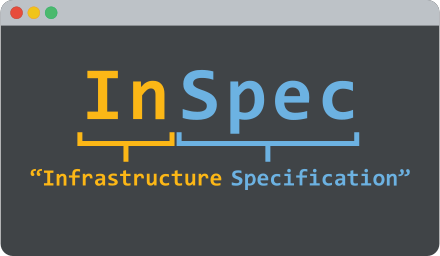
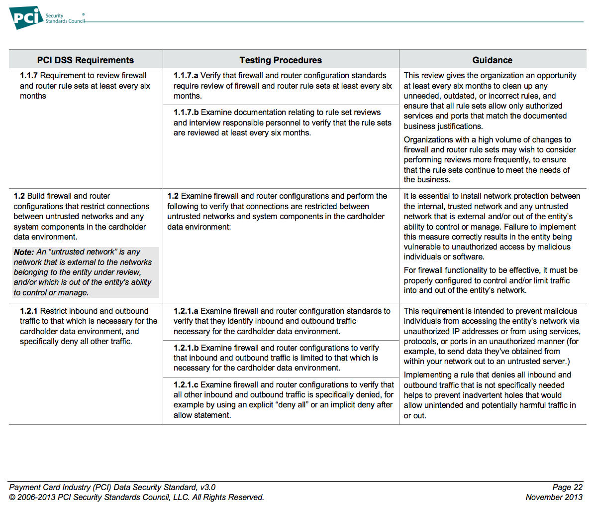

### What is InSpec?

Note: You can use InSpec to examine any node in your infrastructure. The InSpec framework runs locally on the node being inspected. As input, it uses controls you write with the InSpec language. If it detects security, compliance or policy issues they are flagged in a log.


### Why not ServerSpec?


### Compliance is Everywhere
|               |               |       |
|:----:|:----:|:----:|
| DoD Security Technical Implementation Guides (<span class="yellow">STIG</span>) | Payment Card Industry Data Security Standards (<span class="yellow">PCI</span>) | Sarbanes-Oxley (<span class="yellow">SOX</span>) |
| Health Information Technology for Economic and Clinical Health (<span class="yellow">HITECH</span>) | Health Insurance Portability and Accountability Act of 1996 (<span class="yellow">HIPAA</span>) | Center for Internet Security (<span class="yellow">CIS</span>) |


### Spreadsheet


### PDF



### XML
```
<Rule id="usgcb-rhel5desktop-rule-2.2.2.5.d" selected="false" weight="10.0" prohibitChanges="false" abstract="false" hidden="false" role="full" severity="unknown">
  <status date="2011-09-30">accepted</status>
  <version update="1"/>
  <title override="0">CCE-15087-0:Disable Mounting of hfs</title>
  <description override="0"> Using the install command inside /etc/modprobe.conf instructs
      the kernel module loading system to run the command specified (here,
      /bin/true) instead of inserting the module in the kernel as normal. This
      effectively prevents usage of these uncommon filesystems.</description>
  <ident system="http://cce.mitre.org">CCE-15087-0</ident>
  <check system="http://oval.mitre.org/XMLSchema/oval-definitions-5" selector="">
    <check-content-ref href="usgcb-rhel5desktop-oval.xml" name="oval:gov.nist.usgcb.rhel:def:20030"/>
  </check>
</Rule>
```
Note: This is great for portability, but usually offers less flexibility, because these documents have highly-fixed schemas.
