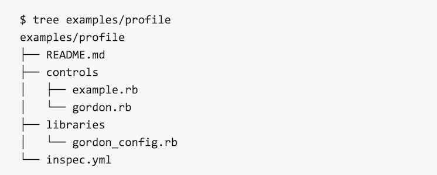
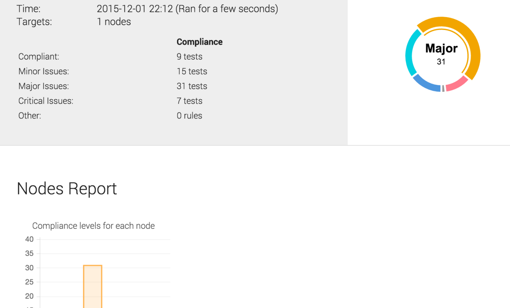

### Who Am I?

* Michael Goetz
* Solutions Engineering Manager @ Chef
* mpgoetz@chef.io
* @michaelpgoetz


### What is InSpec?


Note: You can use InSpec to examine any node in your infrastructure. The InSpec framework runs locally on the node being inspected. As input, it uses controls you write with the InSpec language. If it detects security, compliance or policy issues they are flagged in a log.


### Why not Serverspec?

* Additional metadata (<span class="yellow">impact</span>, <span class="yellow">title</span>, <span class="yellow">description</span>) make it easier to describe & share controls

* Focusing on multi-platform support (<span class="yellow">Windows</span>, <span class="yellow">Docker</span>, <span class="yellow">Linux</span>)

* A command line interface (<span class="yellow">CLI</span>) is required for faster iteration of test code.
Note: Serverspec is great. Mizzy is great. We needed more extensibility and a focus on multi-platform. We also wanted to bring in the metadata that compliance & security professionals require.


### Compliance is Everywhere

|               |               |       |
|:----:|:----:|:----:|
| DoD Security Technical Implementation Guides (<span class="yellow">STIG</span>) | Payment Card Industry Data Security Standards (<span class="yellow">PCI</span>) | Sarbanes-Oxley (<span class="yellow">SOX</span>) |
| Health Information Technology for Economic and Clinical Health (<span class="yellow">HITECH</span>) | Health Insurance Portability and Accountability Act of 1996 (<span class="yellow">HIPAA</span>) | Center for Internet Security (<span class="yellow">CIS</span>) |
Note: Compliance and security mandates change often and new ones are created every day. You have to have a system that lets you quickly validate compliance and provide a report that others can consume.


### Spreadsheet


### PDF


### XML

```
<Rule id="usgcb-rhel5desktop-rule-2.2.2.5.d" selected="false" weight="10.0" prohibitChanges="false" abstract="false" hidden="false" role="full" severity="unknown">
  <status date="2011-09-30">accepted</status>
  <version update="1"/>
  <title override="0">CCE-15087-0:Disable Mounting of hfs</title>
  <description override="0"> Using the install command inside /etc/modprobe.conf instructs
      the kernel module loading system to run the command specified (here,
      /bin/true) instead of inserting the module in the kernel as normal. This
      effectively prevents usage of these uncommon filesystems.</description>
  <ident system="http://cce.mitre.org">CCE-15087-0</ident>
  <check system="http://oval.mitre.org/XMLSchema/oval-definitions-5" selector="">
    <check-content-ref href="usgcb-rhel5desktop-oval.xml" name="oval:gov.nist.usgcb.rhel:def:20030"/>
  </check>
</Rule>
```
Note: This is great for portability, but usually offers less flexibility, because these documents have highly-fixed schemas.


### Anatomy of a control

```
describe sshd_config do
  its('Port') { should eq('22') }
end
```
* <span class="yellow">`describe`</span> is a block that contains at least one test

* <span class="yellow">`sshd_config`</span> is an InSpec resource
Note: There are dozens of pre-built resources. From apache_conf to yum.


### Anatomy of a control

```
control 'sshd-8' do
  impact 0.6
  title 'Server: Configure the service port'
  desc '
    Always specify which port the SSH server should listen to.
    Prevent unexpected settings.
  '
  describe sshd_config do
    its('Port') { should eq('22') }
  end
end
```
* <span class="yellow">`'sshd-8'`</span> is the name of the control

* <span class="yellow">`control`</span> must contain at least one `describe` block

* <span class="yellow">`impact`</span>, <span class="yellow">`title`</span>, and <span class="yellow">`desc`</span> define metadata to describe the control


### Profiles


* <span class="yellow">`inspec.yml`</span> - the profile description (required)
* <span class="yellow">`controls`</span> - contains all tests (required)
* <span class="yellow">`libraries`</span> - contains InSpec resource extensions (optional)


### Profile Manifest
```
name: profile
title: InSpec Example Profile
maintainer: Chef Software, Inc.
copyright: Chef Software, Inc.
copyright_email: support@chef.io
license: Apache 2 license
summary: Demonstrates the use of InSpec Compliance Profile
version: 1.0.0
supports:
  - os-family: linux
```

* <span class="yellow">`name`</span> - Identifier of the profile (required)
* Profiles can also be included in other profiles by referring to the name.
Note: **name** - Identifier of the profile (required)</br>**title** - Human-readable name of the profile (optional)</br>**maintainer** - Name of the profile maintainer (optional)</br>**copyright** - Copyright holder (optional)</br>**copyright_email** - Support contact for profile (optional)</br>**license** - License of the profile (optional)</br>**summary** - One-line summary of the profile (optional)</br>**description** - Description of the profile (optional)</br>**version** - Version of the profile (optional)</br>**supports** - A list of supported targets (optional)


### Profile OS Support

```
supports:
  // Runs on any version of Debian Linux
  - os-name: debian

  // Only runs on Ubuntu 14.04
  - os-name: ubuntu
    release: 14.04

  // Targets RedHat, CentOS, Oracle Linux ...
  - os-family: redhat
```
Restrict your profiles to only support targeted operating systems.


### Profile Inheritance
```
include_controls 'cis-level-1' do

  skip_control "cis-fs-2.1"
  skip_control "cis-fs-2.2"

  control "cis-fs-2.7" do
    impact 1.0
  ...

end
```
Include all controls from external profiles and skip specific controls if necessary.


### Profile Control Inclusion
```
require_controls 'cis-level-1' do

  control "cis-fs-2.1"
  control "cis-fs-2.2"

end
```
If you just need a few controls from a profile, you can require just specific controls.


### Profile Validation & Distribution
```
$ inspec check examples/profile
```

Check your profile syntax with the <span class="yellow">`inspec check`</span> command.

```
# will generate a example-profile.tar.gz
$ inspec archive examples/profile

# will generate a example-profile.zip
$ inspec archive examples/profile --zip
```

Package and redistribute using <span class="yellow">`gzip`</span>, <span class="yellow">`bzip2`</span>, or <span class="yellow">`xz`</span>


### Custom Resources
Just like Chef, you can define your own custom InSpec resources if you need them.

```
require 'yaml'

class GordonConfig < Inspec.resource(1)
  name 'gordon_config'

  def initialize
    @path = '/etc/gordon/config.yaml'
    @file = inspec.file(@path)
    return skip_resource "Can't find file \"#{@path}\"" if !@file.file?

    @params = YAML.load(@file.content)
  end

  def method_missing(name)
    @params[name.to_s]
  end
end
```

Include them in <span class="yellow">`libraries`</span> folder in your profiles.


### Running InSpec tests

* Local
```
inspec exec test.rb
```

* Remote via SSH
```
inspec exec test.rb -t ssh://user@hostname
```

* Remote via WinRM
```
inspec exec test.rb -t winrm://Administrator@windowshost --password 'password'
```

* Docker, Docker, Docker
```
inspec exec test.rb -t docker://container_id
```


### Visualize results with Chef Compliance




### Demo


### More Information

* The Road to InSpec - https://www.chef.io/blog/2015/11/04/the-road-to-inspec/
* InSpec - https://github.com/chef/inspec
* InSpec Reference - https://docs.chef.io/inspec_reference.html


### Thank You!

What questions do you have?
